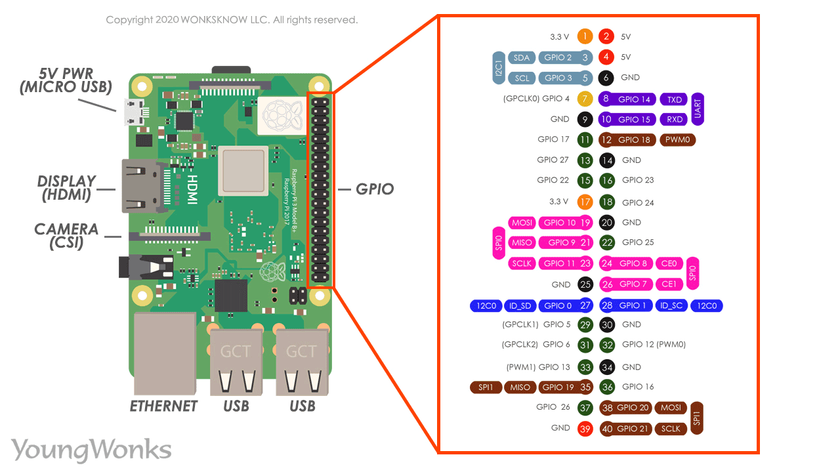

# Shrimpy - Raspberry Pi Discord Light Control

A Discord bot that runs on a Raspberry Pi and allows users to physically toggle a 5V relay (to turn a lightbulb on/off) using a persistent UI button in Discord.

## Hardware Requirements
* Raspberry Pi (Any model with GPIO headers)
* 5V Relay Module (Mechanical or Solid State)
* Jumper Wires

> **⚠️ CAUTION:** If you are using this to switch 110V/220V mains voltage (like a standard lightbulb), ensure your relay is properly rated and that you follow all safety protocols to avoid electrocution or fire hazards. If you are inexperienced, start with a low-voltage LED strip.

## Software Setup

### 1. Install Dependencies
SSH into your Raspberry Pi or open the terminal and install the required Python libraries:

```bash
pip3 install -r requirements.txt
```

### 2. Configure Discord Bot Intents
Before running the bot, you must enable the "Message Content Intent" so the bot can read your setup commands.
1. Go to the [Discord Developer Portal](https://discord.com/developers/applications).
2. Select your application and go to the **Bot** tab.
3. Scroll down to **Privileged Gateway Intents**.
4. Toggle **Message Content Intent** to ON and save changes.

### 3. Run the Bot
Create a file named `.env` in the same directory as your bot script and add your token:

```env
DISCORD_TOKEN=PASTE_YOUR_BOT_TOKEN_HERE
```

Then, run the script:

```bash
python3 bot.py
```

### 4. Spawn the Button
1. Invite the bot to your Discord server.
2. Type `!spawn` in any text channel.
3. The bot will send a message with the "Toggle Light" button. 

*Note: Only the user who created the application in the Discord Developer Portal can use the `!spawn` command.*

## Configuration
* **GPIO Pin:** The relay signal pin defaults to `GPIO 17`. You can change this by editing `RELAY_PIN = 17` in `bot.py`.
* **Active High vs Active Low:** Many 5V relays trigger on a `LOW` signal. If your relay turns ON immediately when the script starts, change `active_high=True` to `active_high=False` in `bot.py`.
* **Cooldown:** The button has a built-in 2-second debounce cooldown to protect your relay from chattering and to prevent Discord API rate limits.

## Wiring the Prototype (LED as the "Light Bulb")

**Required Components:** Raspberry Pi, Breadboard, 1x LED, 1x Resistor (220Ω to 330Ω), and 2x Female-to-Male jumper wires.

**Establish Ground:** Connect a jumper wire from a physical Ground pin on the Raspberry Pi (e.g., Pin 39, which is the 2nd to last pin on the inside row) to the negative rail (the blue line) on the breadboard.

**Place the LED:** Insert the LED into the middle of the breadboard. Note that the LED has polarity: the longer leg is the anode (positive) and the shorter leg is the cathode (negative).

**Connect the Resistor:** Place the resistor so it bridges the row containing the LED's short leg (cathode) and the negative rail. Resistors do not have polarity; orientation does not matter.

**Connect the Data Pin:** Connect a jumper wire from a GPIO pin on the Pi (e.g., GPIO 21, which is physical Pin 40, the very last pin on the outside row) to the row containing the LED's long leg (anode).

When your Discord bot sends a HIGH signal to GPIO 21, it outputs 3.3V, pushing current through the LED and resistor to Ground, illuminating the "bulb."

## Troubleshooting

### Error: "can not open gpiochip" or "unable to open /dev/gpiomem"
This is a permissions error. By default, your Linux user might not have permission to control the physical hardware pins. 

To fix this, add your user to the `gpio` group:
```bash
sudo usermod -aG gpio $USER
```
**Important:** You must log out and log back in (or simply `sudo reboot`) for the group changes to take effect. If you still have issues after rebooting, you can run the bot as root using `sudo` as a last resort: `sudo env "PATH=$PATH" python3 bot.py`.

## Reference


